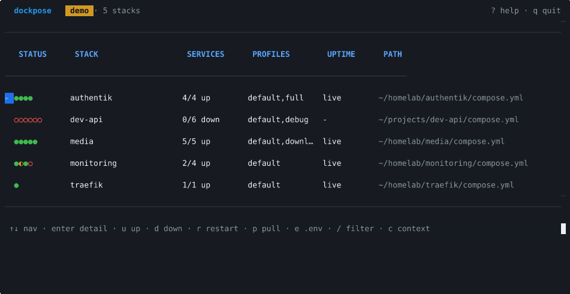

<div align="center">

<h1>dockpose</h1>

<p>
  <a href="https://go.dev/">
    
  </a>
  <a href="https://github.com/charmbracelet/bubbletea">
    
  </a>
  <a href="https://docs.docker.com/compose/">
    
  </a>
  <a href="LICENSE">
    
  </a>
  
</p>

<br>



<strong>A keyboard-driven dashboard for your Docker Compose stacks.</strong>
<br>
Think <em>k9s</em>, but for Compose: one view of every stack you run, start/stop/restart<br>without leaving the terminal, works locally or over SSH.

<p>
  <a href="#try-it-in-30-seconds">Try It</a>&nbsp;&nbsp;·&nbsp;&nbsp;<a href="#who-its-for">Who It's For</a>&nbsp;&nbsp;·&nbsp;&nbsp;<a href="#features">Features</a>&nbsp;&nbsp;·&nbsp;&nbsp;<a href="#how-it-works">How It Works</a>&nbsp;&nbsp;·&nbsp;&nbsp;<a href="#keybinds">Keybinds</a>&nbsp;&nbsp;·&nbsp;&nbsp;<a href="#install">Install</a>
</p>

</div>

## What is this?

If you run a homelab, a VPS, or a handful of services at work with Docker Compose, you probably have a directory of `compose.yml` files and a muscle memory full of:

```sh
cd ~/docker/media && docker compose pull && docker compose up -d
cd ~/docker/monitoring && docker compose restart grafana
cd ~/docker/traefik && docker compose logs -f --tail 200
```

dockpose replaces that dance. It finds every Compose file on your machine, shows them all in one list with live status, and turns every common action — **up, down, restart, pull, logs, shell, edit .env** — into a single keystroke. It's the tool you reach for instead of `cd`-ing around or opening Portainer.

The core idea: **a stack is the unit you care about**, not an individual container. Most container TUIs get this backwards.

> [!NOTE]
> dockpose is pre-v0.1.0. The TUI is fully functional and demo mode works end to end; cross-compiled releases and packaging (Homebrew, AUR, Scoop) are landing next.

## Who It's For

- **Homelabbers** managing 5-50 Compose stacks across one or more machines
- **Developers** juggling several dev stacks locally (database + api + worker + web)
- **Solo operators & small teams** running a VPS or two without Kubernetes
- **Anyone on SSH** who wants a real UI for their remote Docker host without installing a web panel

If you have one Compose file and run it twice a month, you probably don't need this. If you have a `~/docker` folder with ten subdirectories, dockpose is for you.

## Try It in 30 Seconds

No Docker required — demo mode ships a fake homelab so you can kick the tires first:

```sh
git clone https://github.com/cwklurks/dockpose.git
cd dockpose && go build -o dockpose ./cmd/dockpose
./dockpose --demo
```

You'll drop into a synthetic fleet (media, monitoring, traefik, dev-api, authentik) with live-rotating statuses. Every destructive keybind is a safe no-op, so mash away — `?` shows help, `q` quits.

## Features

<details open>
<summary><strong>Stacks are first-class</strong> — not containers</summary>

<br>

The main view is a list of **stacks**, not containers. Hitting `u` runs `docker compose up -d` for the whole stack; `d` brings it down; `r` restarts; `p` pulls new images. If the stack defines Compose profiles, dockpose prompts you to pick one. Individual services live one level deeper, where they belong.

</details>

<details open>
<summary><strong>Auto-discovery</strong> — finds your compose files on first launch</summary>

<br>

Scans `~/docker`, `~/homelab`, `~/projects`, `~/stacks`, and the current directory for `compose.y*ml`, then caches what it finds at `~/.config/dockpose/stacks.toml`. No manual registration, no configuration to write just to see your stuff.

</details>

<details open>
<summary><strong>Dependency graph</strong> — see what depends on what, at a glance</summary>

<br>

Each stack's detail view draws a layered ASCII dependency graph from its `depends_on` declarations. Colored status dots (● healthy / ◐ starting / ○ stopped) sit next to each service so "why isn't the API up?" becomes a visual question: oh, Postgres is red.

</details>

<details>
<summary><strong>Works over SSH</strong> — remote Docker hosts are first-class</summary>

<br>

Point dockpose at any Docker context — `ssh://you@homelab`, `tcp://...`, whatever — and switch between them with `c`. The header always shows which daemon you're talking to, so you never `down` production when you meant staging. No agent to install on the remote host; it's just Docker's built-in SSH transport.

</details>

<details>
<summary><strong>Streaming logs</strong> — follow, filter, timestamps, wrap</summary>

<br>

Tail any single service or every service in the stack at once. Toggles for follow (`f`), timestamps (`t`), line wrap (`w`), and a buffer filter (`/`). Multi-service tails get per-service prefixes so you can actually tell who said what.

</details>

<details>
<summary><strong>.env editor</strong> — with secret masking</summary>

<br>

Edit a stack's `.env` inline without ever pasting secrets into your shell history. Values that look like tokens or keys are masked by default; reveal one with `r` when you need to.

</details>

<details>
<summary><strong>Demo mode</strong> — try it without Docker</summary>

<br>

`--demo` swaps the real Docker backend for a synthetic one with five pre-built stacks and rotating statuses. Perfect for evaluating the tool, recording a screenshot, or showing a teammate what you're talking about. Destructive actions no-op with a friendly toast.

</details>

<details>
<summary><strong>Single static binary</strong> — no runtime, no dependencies</summary>

<br>

One Go binary, cross-compiled for macOS, Linux, and Windows on amd64 and arm64. Drop it on any box. Packaging for Homebrew, AUR, Scoop, apt, and rpm is on the v0.1.0 roadmap.

</details>

## How It Works

### The 30-second version

1. On first launch, dockpose walks a few directories looking for `compose.yml` / `compose.yaml` files.
2. It parses each one with the **same library Docker Compose itself uses**, so there's no "dockpose dialect" — if `docker compose` accepts it, dockpose does too.
3. It talks to the Docker daemon over its normal socket (or SSH, for remote hosts), and polls container state every 2 seconds to keep the UI honest.
4. When you press a key, it shells out to `docker compose` under the hood. dockpose is a UI layer, not a reimplementation — your stacks stay yours.

### Architecture

dockpose is built on [Bubble Tea](https://github.com/charmbracelet/bubbletea) (Elm-style TUI) and [Lip Gloss](https://github.com/charmbracelet/lipgloss) for styling, with the official [Docker SDK for Go](https://github.com/docker/docker) for daemon communication. Compose parsing uses [`compose-spec/compose-go`](https://github.com/compose-spec/compose-go) — the same library Compose itself uses, so v2 manifests parse identically to `docker compose`.

```
internal/
├── docker/      # Source interface; ClientSource (live) + container queries
├── stack/       # Compose parsing, dependency graph, registry, action shims
├── discover/    # Filesystem walker for compose.y*ml
├── demo/        # Synthetic Source: fixture stacks + rotating statuses
├── ui/          # Bubble Tea root + screens (stacklist, detail, logs, modals)
└── config/      # XDG config + cache I/O
```

### The Source abstraction

The TUI talks to a single `docker.Source` interface — implemented by `ClientSource` (real Docker) and `demo.Source` (synthetic). This means demo mode and production mode share every line of UI code, so bugs in either path surface in both. It's also how you could, in theory, add a Podman or k8s-compose backend later.

### Stack-aware polling

A 2-second tick refreshes container states for every known stack using the same query the detail view uses, so the status dots on the list and the per-service table never disagree. The detail view's refresh is debounced to the same tick to avoid hammering remote daemons over slow SSH links.

## Keybinds

<details open>
<summary><strong>Stack list</strong></summary>

<br>

| Key | Action |
| --- | --- |
| `↑/k` `↓/j` | navigate |
| `g` / `G` | jump to top / bottom |
| `enter` | open stack detail |
| `u` | up (prompts for profile if multiple defined) |
| `d` | down |
| `r` | restart |
| `p` | pull |
| `e` | edit `.env` |
| `c` | switch Docker context |
| `/` | filter |
| `?` | help overlay |
| `q` | quit |

</details>

<details>
<summary><strong>Stack detail</strong></summary>

<br>

| Key | Action |
| --- | --- |
| `l` | tail logs for the selected service |
| `s` | open shell in container |
| `x` | stop service |
| `R` | restart service |
| `i` | inspect container (JSON) |
| `esc` | back to stack list |

</details>

<details>
<summary><strong>Logs</strong></summary>

<br>

| Key | Action |
| --- | --- |
| `f` | toggle follow |
| `t` | toggle timestamps |
| `w` | toggle line wrap |
| `c` | clear buffer |
| `g` / `G` | top / bottom |
| `/` | filter buffer |

</details>

## Install

> [!IMPORTANT]
> Pre-v0.1.0: packaging (Homebrew, AUR, Scoop, apt, rpm) is landing soon. For now, build from source — it's one `go build`.

```sh
git clone https://github.com/cwklurks/dockpose.git
cd dockpose
go build -o dockpose ./cmd/dockpose
./dockpose --version

# or, with the full lint + test suite:
make check
```

**Requirements:** Go 1.25+ and Docker. `make check` additionally needs `make` and `golangci-lint`.

<details>
<summary><strong>Regenerating the demo recording</strong></summary>

<br>

Three paths, depending on what you have installed:

```sh
# 1. Cast file (zero system deps): records frames programmatically.
go run ./cmd/dockpose-record > docs/media/demo.cast

# 2. GIF from cast (requires `agg` from asciinema/agg releases):
agg --theme github-dark --font-size 13 --speed 1.2 \
    docs/media/demo.cast docs/media/demo.gif

# 3. Or, with vhs + ttyd installed, drive the real binary:
go build -o ./dockpose ./cmd/dockpose
vhs docs/media/demo.tape
```

</details>

## Roadmap

Near-term, in rough priority order:

- **v0.1.0** — Cross-compiled release binaries via [GoReleaser](https://goreleaser.com), Homebrew tap, AUR PKGBUILD, Scoop manifest.
- **Persistent stack registry** — honor the `~/.config/dockpose/stacks.toml` cache and refresh it lazily instead of rescanning every launch.
- **Filter persistence** — remember active filter and cursor position across sessions.
- **Pull progress** — live `docker compose pull` progress in the status bar instead of a single "done" toast.
- **Healthcheck-aware status** — distinguish "running but unhealthy" using Docker healthchecks instead of treating every running container as healthy.
- **Container events stream** — replace the 2s poll with Docker's events API for sub-second updates.
- **Theming** — more than the current GitHub Dark palette.

Further out: Podman backend, Compose file editor, secrets integration. [Open an issue](https://github.com/cwklurks/dockpose/issues) if there's something you want sooner.

## Contributing

See [CONTRIBUTING.md](CONTRIBUTING.md). Bug reports and feature ideas welcome via [Issues](https://github.com/cwklurks/dockpose/issues).

## License

[MIT](LICENSE).

## Disclaimer

dockpose is an independent open-source project and is not affiliated with, endorsed by, or sponsored by Docker, Inc.
